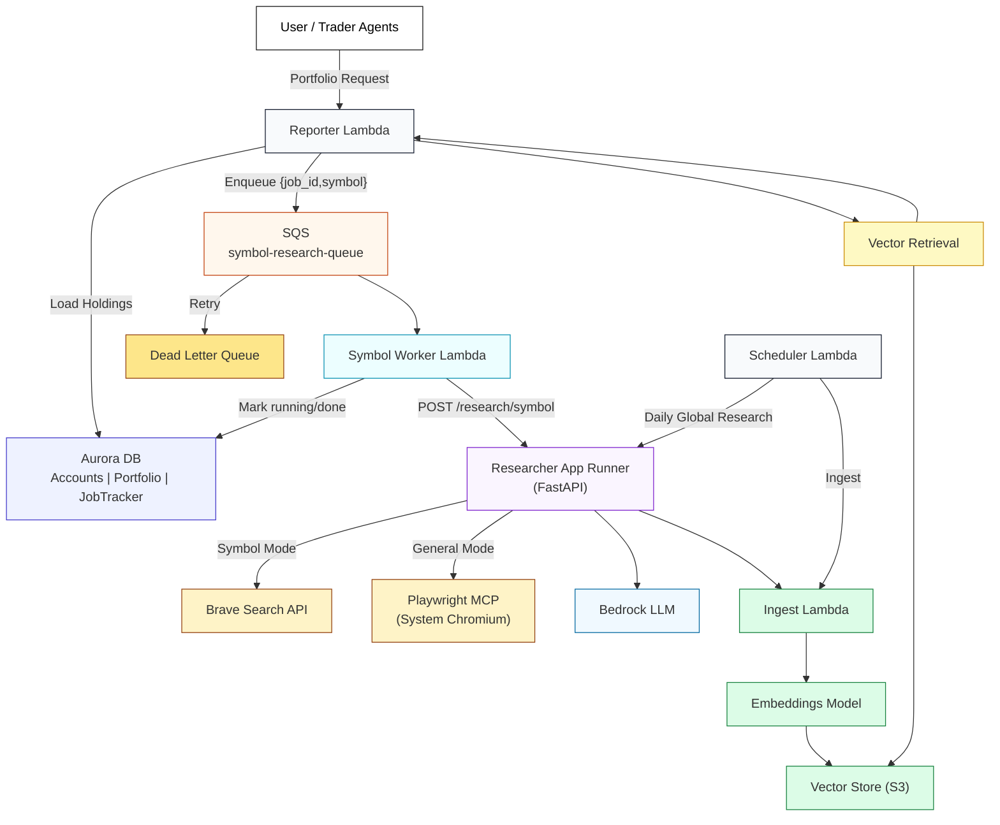

```mermaid
graph TD

%% ================= USER & AGENTS =================

USER["User / Trader Agents"]
REP["Reporter Lambda"]
SCHED["Scheduler Lambda"]

%% ================= DATA ==================
DB["Aurora DB<br/>Accounts | Portfolio | JobTracker"]

%% ================= QUEUE =================
SQS["SQS<br/>symbol-research-queue"]
DLQ["Dead Letter Queue"]

%% ================= WORKERS =================
WORKER["Symbol Worker Lambda"]

%% ================= RESEARCHER =================
RES["Researcher App Runner<br/>(FastAPI)"]

%% ================= TOOLS =================
BRAVE["Brave Search API"]
BROWSE["Playwright MCP<br/>(System Chromium)"]
LLM["Bedrock LLM"]

%% ================= INGEST =================
INGEST["Ingest Lambda"]
EMB["Embeddings Model"]
VEC["Vector Store (S3)"]

%% ================= RETRIEVAL =================
RETR["Vector Retrieval"]

%% ================= FLOW =================

USER -->|"Portfolio Request"| REP
REP -->|"Load Holdings"| DB

REP -->|"Enqueue {job_id,symbol}"| SQS
SQS -->|"Retry"| DLQ

SQS --> WORKER
WORKER -->|"POST /research/symbol"| RES
WORKER -->|"Mark running/done"| DB

%% -------- Researcher behavior ----------
RES -->|"Symbol Mode"| BRAVE
RES -->|"General Mode"| BROWSE
RES --> LLM

%% -------- Ingestion ----------
RES --> INGEST
INGEST --> EMB
EMB --> VEC

%% -------- Retrieval ----------
REP --> RETR
RETR --> VEC
RETR --> REP

%% -------- Scheduler ----------
SCHED -->|"Daily Global Research"| RES
SCHED -->|"Ingest"| INGEST

%% ================= STYLING =================

style USER fill:#ffffff,stroke:#111,color:#000,fontWeight:bold
style REP fill:#f8fafc,stroke:#0f172a,fontWeight:bold
style SCHED fill:#f8fafc,stroke:#0f172a,fontWeight:bold

style DB fill:#eef2ff,stroke:#4338ca,fontWeight:bold

style SQS fill:#fff7ed,stroke:#c2410c,fontWeight:bold
style DLQ fill:#fde68a,stroke:#92400e

style WORKER fill:#ecfeff,stroke:#0891b2,fontWeight:bold

style RES fill:#faf5ff,stroke:#7e22ce,fontWeight:bold

style BRAVE fill:#fef3c7,stroke:#92400e
style BROWSE fill:#fef3c7,stroke:#92400e
style LLM fill:#f0f9ff,stroke:#0369a1

style INGEST fill:#dcfce7,stroke:#15803d,fontWeight:bold
style EMB fill:#dcfce7,stroke:#15803d
style VEC fill:#dcfce7,stroke:#15803d

style RETR fill:#fef9c3,stroke:#ca8a04,fontWeight:bold
```