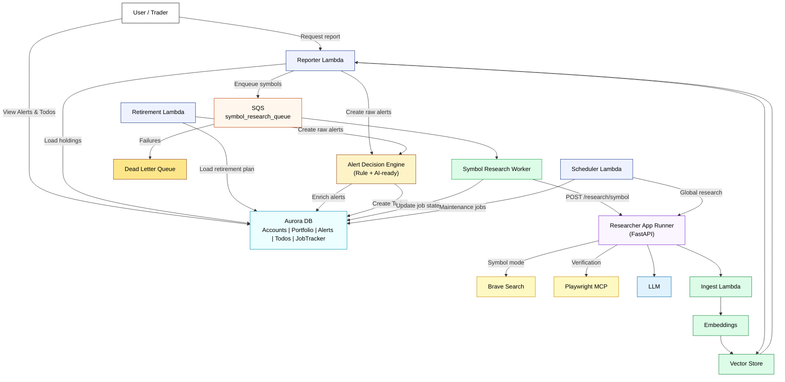

```mermaid
graph TD

%% ================= USER =================
USER["User / Trader"]

%% ================= AGENTS =================
REP["Reporter Lambda"]
RET["Retirement Lambda"]
SCHED["Scheduler Lambda"]

%% ================= INTELLIGENCE =================
ENG["Alert Decision Engine<br/>(Rule + AI-ready)"]

%% ================= DATA STORES =================
DB["Aurora DB<br/>Accounts | Portfolio | Alerts | Todos | JobTracker"]

%% ================= QUEUE =================
SQS["SQS<br/>symbol_research_queue"]
DLQ["Dead Letter Queue"]

%% ================= WORKERS =================
WORKER["Symbol Research Worker"]

%% ================= RESEARCH =================
RES["Researcher App Runner<br/>(FastAPI)"]

%% ================= TOOLS =================
BRAVE["Brave Search"]
BROWSE["Playwright MCP"]
LLM["LLM"]

%% ================= INGEST =================
INGEST["Ingest Lambda"]
EMB["Embeddings"]
VEC["Vector Store"]

%% ================= FLOWS =================

USER -->|"Request report"| REP
USER -->|"View Alerts & Todos"| DB

REP -->|"Load holdings"| DB
RET -->|"Load retirement plan"| DB

REP -->|"Create raw alerts"| ENG
RET -->|"Create raw alerts"| ENG

ENG -->|"Enrich alerts"| DB
ENG -->|"Create Todos"| DB

%% ---------- Research Pipeline ----------
REP -->|"Enqueue symbols"| SQS
SQS --> WORKER
WORKER -->|"POST /research/symbol"| RES
WORKER -->|"Update job state"| DB
SQS -->|"Failures"| DLQ

%% ---------- Researcher Tools ----------
RES -->|"Symbol mode"| BRAVE
RES -->|"Verification"| BROWSE
RES --> LLM

%% ---------- Knowledge Ingest ----------
RES --> INGEST
INGEST --> EMB
EMB --> VEC

%% ---------- Retrieval ----------
REP --> VEC
VEC --> REP

%% ---------- Scheduler ----------
SCHED -->|"Global research"| RES
SCHED -->|"Maintenance jobs"| DB

%% ================= STYLING (BLACK TEXT) =================

style USER fill:#ffffff,stroke:#111,color:#000,fontWeight:bold

style REP fill:#eef2ff,stroke:#1e3a8a,color:#000,fontWeight:bold
style RET fill:#eef2ff,stroke:#1e3a8a,color:#000,fontWeight:bold
style SCHED fill:#eef2ff,stroke:#1e3a8a,color:#000,fontWeight:bold

style ENG fill:#fef3c7,stroke:#92400e,color:#000,fontWeight:bold

style DB fill:#ecfeff,stroke:#0891b2,color:#000,fontWeight:bold

style SQS fill:#fff7ed,stroke:#c2410c,color:#000
style DLQ fill:#fde68a,stroke:#92400e,color:#000

style WORKER fill:#dcfce7,stroke:#16a34a,color:#000,fontWeight:bold
style RES fill:#faf5ff,stroke:#7e22ce,color:#000,fontWeight:bold

style BRAVE fill:#fef9c3,stroke:#ca8a04,color:#000
style BROWSE fill:#fef9c3,stroke:#ca8a04,color:#000
style LLM fill:#e0f2fe,stroke:#0369a1,color:#000

style INGEST fill:#dcfce7,stroke:#15803d,color:#000
style EMB fill:#dcfce7,stroke:#15803d,color:#000
style VEC fill:#dcfce7,stroke:#15803d,color:#000

```