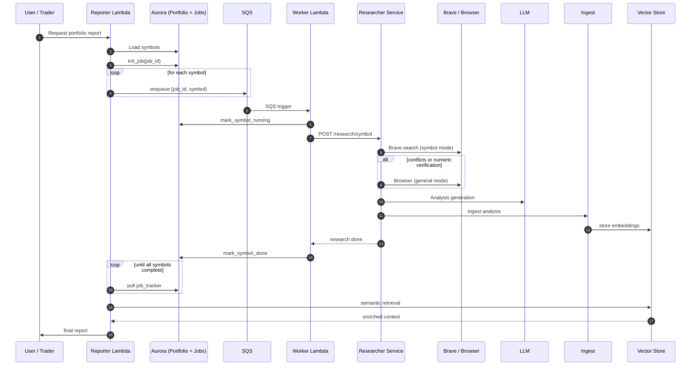

```mermaid
sequenceDiagram
    autonumber

    participant U as User / Trader
    participant R as Reporter Lambda
    participant DB as Aurora (Portfolio + Jobs)
    participant Q as SQS
    participant W as Worker Lambda
    participant RES as Researcher Service
    participant B as Brave / Browser
    participant L as LLM
    participant I as Ingest
    participant V as Vector Store

    U->>R: Request portfolio report
    R->>DB: Load symbols

    R->>DB: init_job(job_id)
    
    loop for each symbol
        R->>Q: enqueue {job_id, symbol}
    end

    Q->>W: SQS trigger
    W->>DB: mark_symbol_running
    W->>RES: POST /research/symbol

    RES->>B: Brave search (symbol mode)
    alt conflicts or numeric verification
        RES->>B: Browser (general mode)
    end
    RES->>L: Analysis generation

    RES->>I: ingest analysis
    I->>V: store embeddings

    RES-->>W: research done
    W->>DB: mark_symbol_done

    loop until all symbols complete
        R->>DB: poll job_tracker
    end

    R->>V: semantic retrieval
    V-->>R: enriched context
    R->>U: final report
```