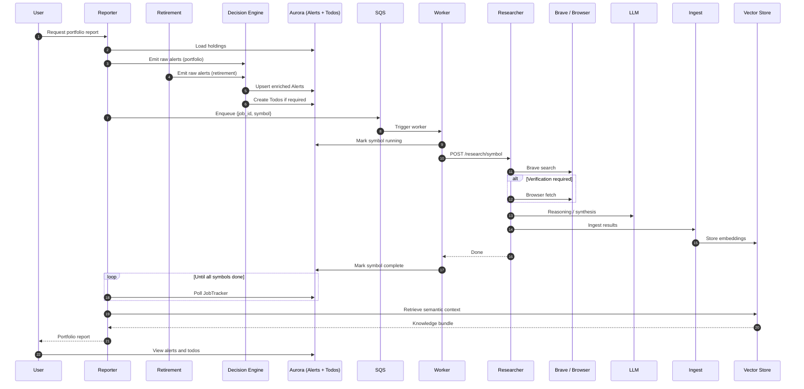

```mermaid
sequenceDiagram
    autonumber

    participant U as User
    participant R as Reporter
    participant RET as Retirement
    participant ENG as Decision Engine
    participant DB as Aurora (Alerts + Todos)
    participant Q as SQS
    participant W as Worker
    participant RES as Researcher
    participant B as Brave / Browser
    participant L as LLM
    participant I as Ingest
    participant V as Vector Store

    %% ---------- Reporting ----------
    U->>R: Request portfolio report
    R->>DB: Load holdings

    %% ---------- Intelligence ----------
    R->>ENG: Emit raw alerts (portfolio)
    RET->>ENG: Emit raw alerts (retirement)

    ENG->>DB: Upsert enriched Alerts
    ENG->>DB: Create Todos if required

    %% ---------- Research Queue ----------
    R->>Q: Enqueue {job_id, symbol}

    Q->>W: Trigger worker
    W->>DB: Mark symbol running
    W->>RES: POST /research/symbol

    %% ---------- Research ----------
    RES->>B: Brave search
    alt Verification required
        RES->>B: Browser fetch
    end
    RES->>L: Reasoning / synthesis

    %% ---------- Ingest ----------
    RES->>I: Ingest results
    I->>V: Store embeddings

    %% ---------- Completion ----------
    RES-->>W: Done
    W->>DB: Mark symbol complete

    loop Until all symbols done
        R->>DB: Poll JobTracker
    end

    %% ---------- Enrichment ----------
    R->>V: Retrieve semantic context
    V-->>R: Knowledge bundle

    %% ---------- Final Output ----------
    R-->>U: Portfolio report
    U->>DB: View alerts and todos

```