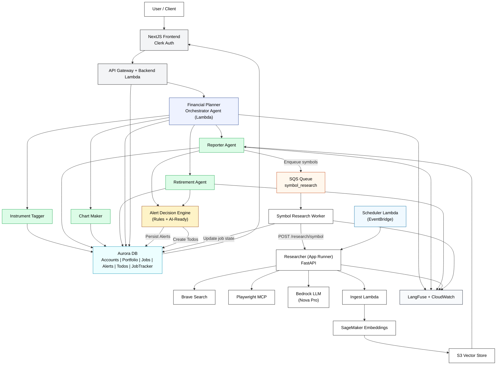

```mermaid

flowchart TD

%% ===================== USER & FRONTEND =====================
USER["User / Client"]
UI["NextJS Frontend<br/>Clerk Auth"]
API["API Gateway + Backend Lambda"]

USER --> UI
UI --> API

%% ===================== CORE ORCHESTRATOR =====================
PLANNER["Financial Planner<br/>Orchestrator Agent (Lambda)"]

API --> PLANNER

%% ===================== CORE AGENTS =====================
TAGGER["Instrument Tagger"]
REPORTER["Reporter Agent"]
CHARTER["Chart Maker"]
RETIREMENT["Retirement Agent"]

PLANNER --> TAGGER
PLANNER --> REPORTER
PLANNER --> CHARTER
PLANNER --> RETIREMENT

%% ===================== DATABASE =====================
DB["Aurora DB<br/>Accounts | Portfolio | Jobs | Alerts | Todos | JobTracker"]

TAGGER --> DB
REPORTER --> DB
CHARTER --> DB
RETIREMENT --> DB
PLANNER --> DB
API --> DB
DB --> UI

%% ===================== ALERT INTELLIGENCE =====================
ALERT_ENGINE["Alert Decision Engine<br/>(Rules + AI-Ready)"]

REPORTER --> ALERT_ENGINE
RETIREMENT --> ALERT_ENGINE

ALERT_ENGINE -->|"Persist Alerts"| DB
ALERT_ENGINE -->|"Create Todos"| DB

%% ===================== RESEARCH PIPELINE =====================
SQS["SQS Queue<br/>symbol_research"]
WORKER["Symbol Research Worker"]
RESEARCHER["Researcher (App Runner)<br/>FastAPI"]
BRAVE["Brave Search"]
BROWSER["Playwright MCP"]
LLM["Bedrock LLM<br/>(Nova Pro)"]

REPORTER -->|"Enqueue symbols"| SQS
SQS --> WORKER
WORKER -->|"POST /research/symbol"| RESEARCHER
WORKER -->|"Update job state"| DB

RESEARCHER --> BRAVE
RESEARCHER --> BROWSER
RESEARCHER --> LLM

%% ===================== KNOWLEDGE PIPELINE =====================
INGEST["Ingest Lambda"]
EMB["SageMaker Embeddings"]
VEC["S3 Vector Store"]

RESEARCHER --> INGEST
INGEST --> EMB
EMB --> VEC
VEC --> REPORTER

%% ===================== SCHEDULER (CORRECTED) =====================
SCHED["Scheduler Lambda<br/>(EventBridge)"]

SCHED --> RESEARCHER

%% ===================== OBSERVABILITY =====================
OBS["LangFuse + CloudWatch"]

PLANNER --> OBS
REPORTER --> OBS
RETIREMENT --> OBS
RESEARCHER --> OBS
WORKER --> OBS

%% ===================== STYLING =====================
classDef default fill:#ffffff,stroke:#111,color:#000,fontWeight:normal

style USER fill:#ffffff,stroke:#111,color:#000,fontWeight:bold
style UI fill:#f3f4f6,stroke:#111,color:#000
style API fill:#f3f4f6,stroke:#111,color:#000

style PLANNER fill:#eef2ff,stroke:#1e3a8a,color:#000,fontWeight:bold

style TAGGER fill:#dcfce7,stroke:#16a34a,color:#000
style REPORTER fill:#dcfce7,stroke:#16a34a,color:#000
style CHARTER fill:#dcfce7,stroke:#16a34a,color:#000
style RETIREMENT fill:#dcfce7,stroke:#16a34a,color:#000

style ALERT_ENGINE fill:#fef3c7,stroke:#92400e,color:#000,fontWeight:bold

style DB fill:#ecfeff,stroke:#0891b2,color:#000,fontWeight:bold

style SQS fill:#fff7ed,stroke:#c2410c,color:#000,fontWeight:bold

style SCHED fill:#f0f9ff,stroke:#0369a1,color:#000,fontWeight:bold

style OBS fill:#f8fafc,stroke:#0f172a,color:#000,fontWeight:bold

style BRAVE fill:#ffffff,stroke:#111,color:#000
style BROWSER fill:#ffffff,stroke:#111,color:#000
style LLM fill:#ffffff,stroke:#111,color:#000

style INGEST fill:#ffffff,stroke:#111,color:#000
style EMB fill:#ffffff,stroke:#111,color:#000
style VEC fill:#ffffff,stroke:#111,color:#000
```