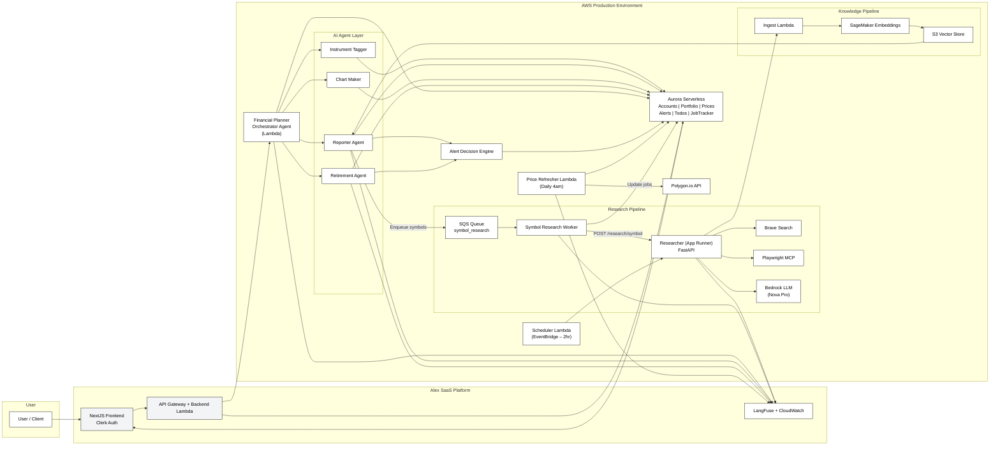

```mermaid

flowchart LR

%% ===================== USER ENV =====================
subgraph USER_ENV["User"]
USER["User / Client"]
end

%% ===================== SAAS APP =====================
subgraph SAAS["Alex SaaS Platform"]
UI["NextJS Frontend<br/>Clerk Auth"]
API["API Gateway + Backend Lambda"]
OBS["LangFuse + CloudWatch"]
end

%% ===================== AWS CORE =====================
subgraph AWS["AWS Production Environment"]

%% Orchestrator
PLANNER["Financial Planner<br/>Orchestrator Agent<br/>(Lambda)"]

%% Agents
subgraph AGENTS["AI Agent Layer"]
TAGGER["Instrument Tagger"]
REPORTER["Reporter Agent"]
CHARTER["Chart Maker"]
RETIREMENT["Retirement Agent"]
end

%% Database
DB["Aurora Serverless<br/>Accounts | Portfolio | Prices<br/>Alerts | Todos | JobTracker"]

%% Alert Engine
ALERT_ENGINE["Alert Decision Engine"]

%% Research System
subgraph RESEARCH["Research Pipeline"]
SQS["SQS Queue<br/>symbol_research"]
WORKER["Symbol Research Worker"]
RESEARCHER["Researcher (App Runner)<br/>FastAPI"]
BRAVE["Brave Search"]
BROWSER["Playwright MCP"]
LLM["Bedrock LLM<br/>(Nova Pro)"]
end

%% Knowledge
subgraph KNOWLEDGE["Knowledge Pipeline"]
INGEST["Ingest Lambda"]
EMB["SageMaker Embeddings"]
VEC["S3 Vector Store"]
end

%% Schedulers
SCHED["Scheduler Lambda<br/>(EventBridge – 2hr)"]
PRICE["Price Refresher Lambda<br/>(Daily 4am)"]
POLY["Polygon.io API"]

end

%% ===================== CONNECTIONS =====================

%% User
USER --> UI
UI --> API
DB --> UI

%% SaaS → AWS
API --> PLANNER

%% Orchestration
PLANNER --> TAGGER
PLANNER --> REPORTER
PLANNER --> CHARTER
PLANNER --> RETIREMENT

%% DB Writes
TAGGER --> DB
REPORTER --> DB
CHARTER --> DB
RETIREMENT --> DB
PLANNER --> DB
API --> DB

%% Alert Flow
REPORTER --> ALERT_ENGINE
RETIREMENT --> ALERT_ENGINE
ALERT_ENGINE --> DB

%% Research Jobs
REPORTER -->|"Enqueue symbols"| SQS
SQS --> WORKER
WORKER -->|"POST /research/symbol"| RESEARCHER
WORKER -->|"Update jobs"| DB

%% Research System
RESEARCHER --> BRAVE
RESEARCHER --> BROWSER
RESEARCHER --> LLM

%% Knowledge Pipeline
RESEARCHER --> INGEST
INGEST --> EMB
EMB --> VEC
VEC --> REPORTER

%% Scheduler (Research)
SCHED --> RESEARCHER

%% Price Refresh (NEW)
PRICE --> POLY
PRICE --> DB

%% Observability
PLANNER --> OBS
REPORTER --> OBS
RETIREMENT --> OBS
RESEARCHER --> OBS
WORKER --> OBS
PRICE --> OBS

%% ===================== STYLING =====================
classDef default fill:#ffffff,stroke:#111,color:#000,fontWeight:normal

style USER fill:#ffffff,stroke:#111,color:#000,fontWeight:bold
style UI fill:#f3f4f6,stroke:#111,color:#000
style API fill:#f3f4f6,str


```