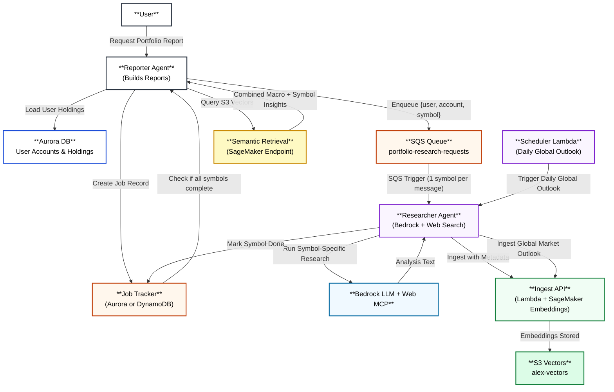
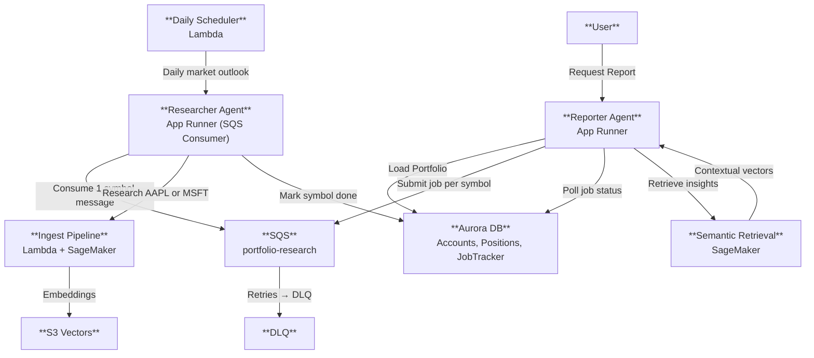
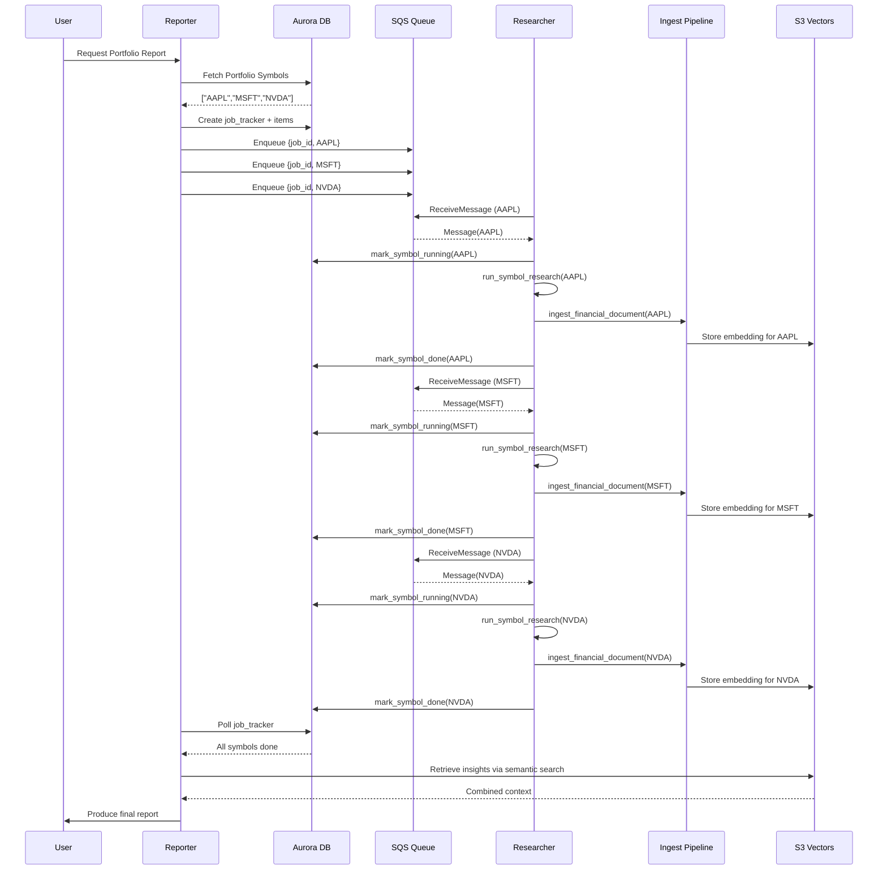
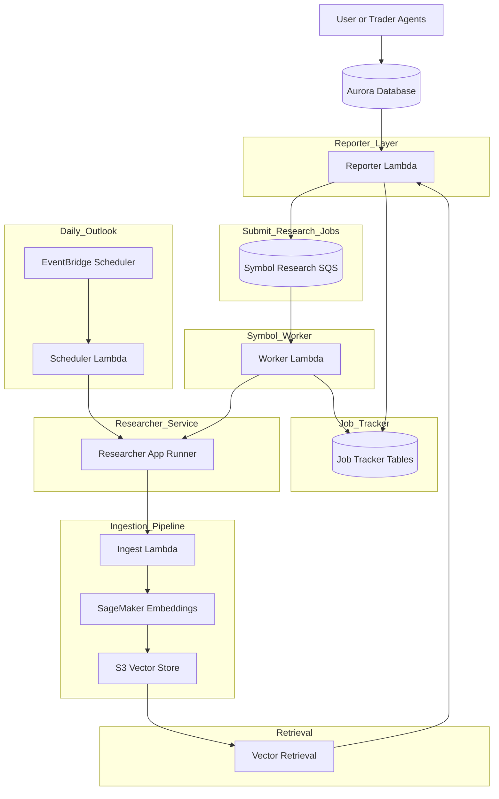
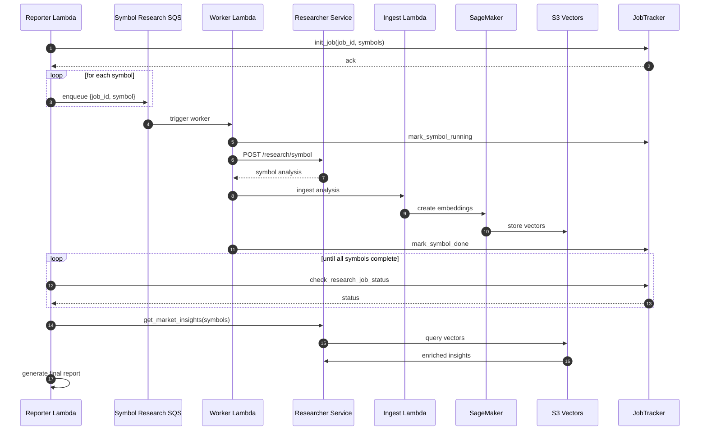

Portfolio (Symbol) research flow

Reporter Lambda (Agent) 
     |
     | submit_portfolio_research_job()
     v
SQS Queue  <---- retry, DLQ support
     |
     | (1 message per symbol)
     v
Research Worker Lambda  <-- NEW
     |
     | POST /research/symbol
     v
Researcher App Runner
     |
     | ingest → embeddings → S3 vectors
     v
JobTracker (Aurora)

Here's how it fits into the Alex architecture:

Updated Mermaid Architecture Diagram

Mermaid Sequence Diagram (End-to-End Flow)

Updated Architecture diagram

Updated Sequence diagram
